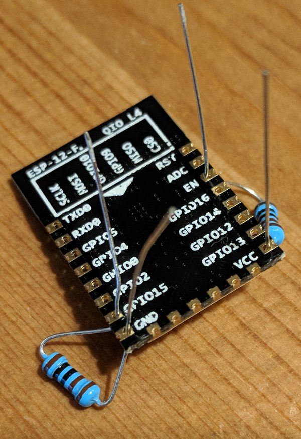
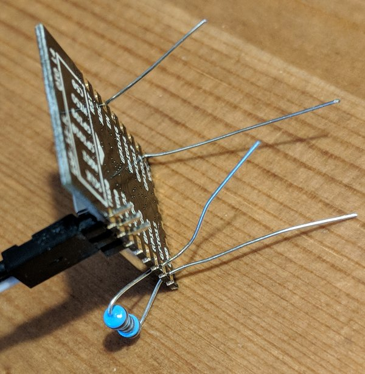

# ESP Dash Button

This is the firmware for a very simplistic ESP8266 based dash-button.

Once powered it’ll connect to WIFI, run a payload and spawn a WIFI Access Point
afterwards, exposing the micropython webrepl allowing you to tinker further.

## Building the hardware

Check out the description at [Hackaday – ESP Dash Button](https://hackaday.io/project/29192-match-box-esp-dash-button)
for details on how to built the device.

## Initial Setup



This is the hardest part, hopefully, you only have to do this once.

1. If not already done, solder the permanent resistors to select the correct boot mode:
   1. A 1k Resistor between GND and GPIO15.
   2. A 1k Resistor between VCC and CHIP\_EN.
2. Make temporary connections for initial flashing:
   1. Connect GPIO0 to GND, e.g. using a another 1k Resistor (but don't solder
      it) or a logic analyzer test clip.
   2. Connect RX and TX to your USB-to-serial converter.<br>
      
      I acquired some 2.0mm Pin headers and 2.0mm to 2.54mm dupont cables,
      that make this a piece of cake, but you can also use clips or other
      wires. The goal is again that you need this only once.
3. Attach a stable 3.3V power supply to GND and VCC.
   **A 3.7V coin-cell or your USB-to-Serial converter power output will not
   suffice and may result in corrupted flash data or even a bricked device!**
   (I drew the power from a NodeMCU board that is able to provide plenty of
   excess power). Logic analyzer testing clips again come in handy for this.
   This is the only connection that you’ll need to re-establish if you want
   to change the software in the future.
4. Flash the initial firmware:
   1. Edit your configuration, in particular `config.py` and `webrepl_cfg.py`
   2. Flash [micropython](http://docs.micropython.org/en/latest/esp8266/esp8266/tutorial/intro.html#deploying-the-firmware) to your ESP board
   3. After reboot, the device exposes a python shell on its serial console.
      Install any dependent modules as needed:
      ```
      screen /dev/ttyUSB0 115200
      import upip
      upip.install('micropython-urequests')
      ```
   4. You can use this shell to develop your payload, once done, save it to
      `payload.py` and run `make flash`

## Modifying your code later

The device should under all circumstances run a WIFI access point eventually,
it’s access params are configured in `config.py`.
You can then use [webrepl](https://github.com/micropython/webrepl) to connect
to the device and inspect it or re-upload files.

**Note again:** The coin cell is not able to provide sufficient current for
flash operations, so if you want to upload files, you need to hook up the device
to an external power supply as described above!

